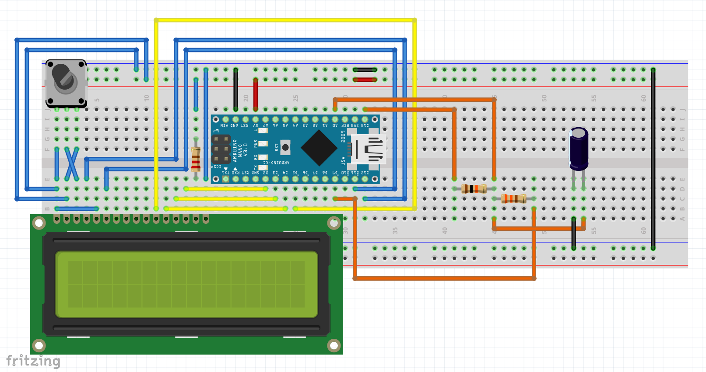
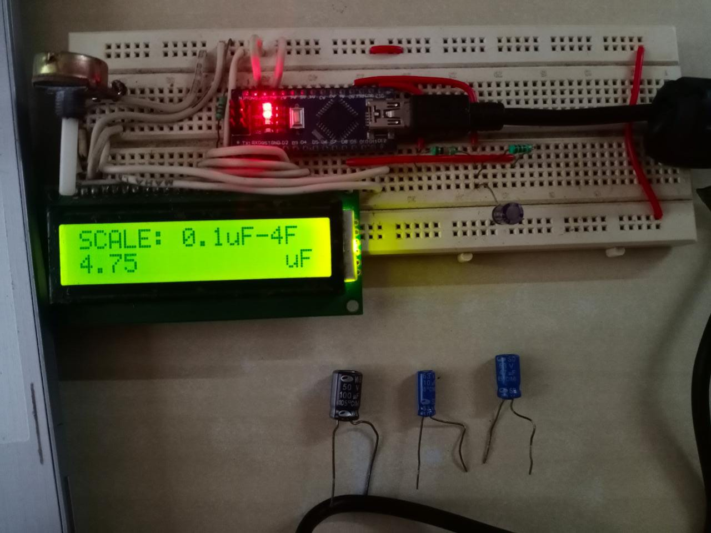
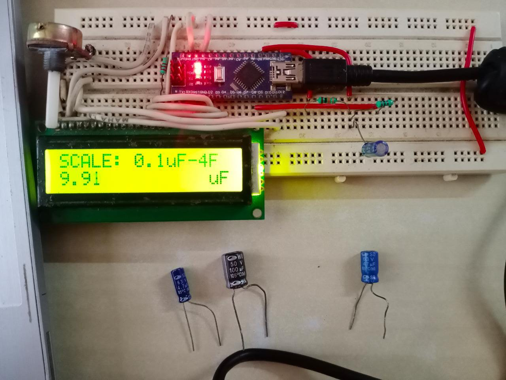
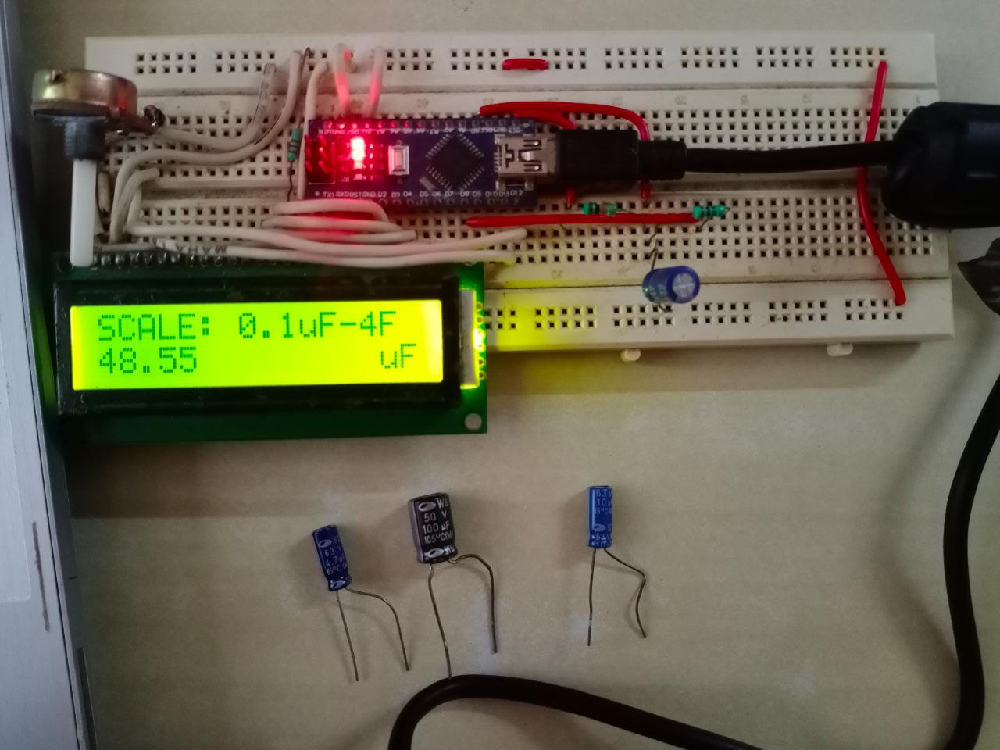
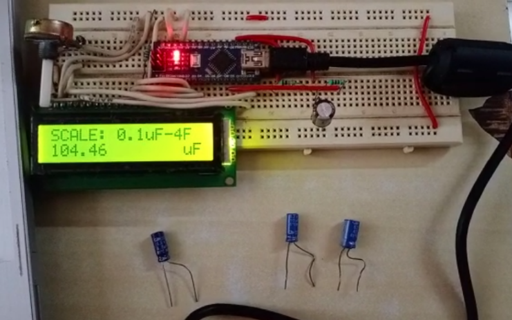

# Capacitance-Meter
A Capacitance Meter is a piece of electronic test equipment whose purpose is to measure capacitance, mostly of discrete capacitors. The capacitance meter works based off of the directly proportional relationship between capacitance and a time constant.

## Components Used:
Arduino Nano, LCD 16x2, Potentiometer, Resistors 10k Ohm & 200 Ohm, Assorted Capacitors, Bread Board, Connecting Wires

## How it all works!:
We apply 5V at the positive terminal. We start counting the time and when the voltage reach 63.2% of the full charge we stop the charge and calculate the capacitance. Arduino has 10 bit ADC so the 63.2% of 1024 is 648. We read these values from the Analog pin. We can obtain the capacitance value because we know the resistance of the circuit, the measured voltage and the time that it took to reach 63.2% of the full charge. From the equation above we obtain C as:

  
C = Tc / R

The Arduino measures the capacitance of the unknown capacitor by recording the time it takes for the capacitor to reach 63.2% of its voltage when fully charged, then dividing that value by the known resistance of the circuit

## Some snaps of the project

  
  
Circuit Diagram

## Circuit in action:

  
  
Readings for 4.7uf capacitor

  
  
Readings for 10uf capacitor

  
  
Readings for 47uf capacitor

  
  
Readings for 100uf capacitor

